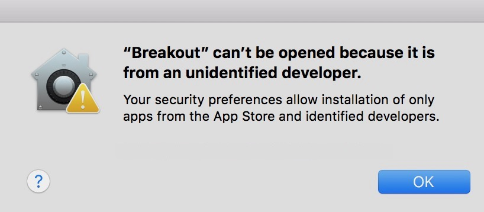

# 

    
    
    
    
    
    

    <a href="#description">Description</a> •
    <a href="#system-requirements">System requirements</a> •
    <a href="#get-started">Get started</a> •
    <a href="#how-to-play">How to play</a> •
    <a href="#license">License</a>

# Description
The all time classic arcade game. The goal is to break all the bricks and get a high score, without dropping the ball. You have only ❤❤❤ lives.

# System requirements

* Java 1.8 
* Java Virtual Machine

# Get started

### Mac users
1. Download the latest Breakout.dmg release from [Releases](https://github.com/georgelivas/breakout/releases/tag/V3.2(2.0)).
2. Drag and drop the app to your Applications folder.
3. Open the app.
    > If a window like this one comes up,
    > 
    > go to:
    ``
    System Preferences > Security & Privacy > General > (click) Open Anyway
    ``
4. Enjoy

### Windows users
1. Download the latest Breakout.jar release from [Releases](https://github.com/georgelivas/breakout/releases/tag/V3.2(2.0)).
2. Save the file.
3. Open the app.
4. Enjoy

# How to play
> This game doesn't support mouse interaction.

After openig the app, use ``up, down and ENTER`` keys to select level. Then control the bat with ``left and right`` keys.

> 

## Controls

|    Key    |       Action     |       Usage     |
| :-------: | :--------------: | :-------------: |
| ``ENTER`` | Select or Return |   Used in menu  |
| ⬆        | Go up            |   Used in menu  |
| ⬇ 	     | Go down          |   Used in menu  |
| ⬅        | Go left          |   Move the bat  |
| ➡         | Go right         |   Move the bat  |
| ``w``     | Go up            |   Used in menu  |
| ``s`` 	  | Go down          |   Used in menu  |
| ``a``     | Go left          |   Move the bat  |
| ``d``     | Go right         |   Move the bat  |
| ``v``     | Mute / Unmute    | Used during game |
| ``p``     | Play / Pause     | Used during game |
| ``f``     | Super fast       | Increase the speed of the ball |
| ``n``     | Normal speed     | Reset speed to normal |

# License
This project is licensed under the MIT License - see the [LICENSE](https://github.com/georgelivas/breakout/blob/master/LICENSE) file for details