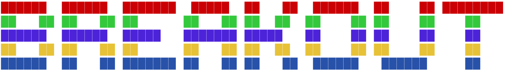

# 

    
    

  <a href="#description">Description</a> •
  <a href="#system-requirements">System requirements</a> •
  <a href="#get-started">Get started</a> •
  <a href="#credits">Credits</a> •
  <a href="#license">License</a>

# Description
The all time classic arcade game. The goal is to break all the bricks and get a high score, without dropping the ball. You have only 3 lives ❤❤❤.

# System requirements

* Java 1.8 
* Java Virtual Machine

# Get started

### Mac users
1. Download the latest breakout.dmg release from [Releases](ADD LINK).
2. Drag and drop the app to your Applications folder.
3. Open the app.
    >If a window like this one comes up,
    >
    >go to:
    ``
    System Preferences > Security & Privacy > General > (click) Open Anyway
    ``
4. Enjoy
### Windows users
1. Download the latest breakout.jar release from [Releases](ADD LINK).
2. Save the file.
3. Open the app.

# License
This project is licensed under the MIT License - see the [LICENSE](https://github.com/georgelivas/breakout/blob/master/LICENSE) file for details